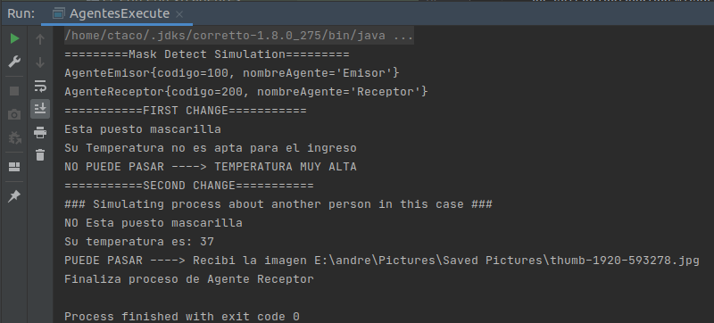
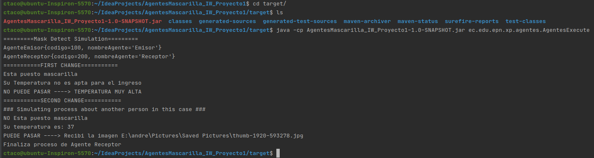

# AgentesMascarilla_IW_Proyecto1
Mask detect simulation in java and jenkins 

### dependencies:
JAVA 8 

JUnit

Mockito

### 1.- OUTPUTS without changes
  #### AgentesExecute
  
  
  
  ### JAR Execute
  
  

### 2.- OUTPUTS with FIRST change
  #### AgentesExecute
  
  
  
  ### JAR Execute
  
  

### 3.- OUTPUTS with SECOND change
  #### AgentesExecute
  
  
  
  ### JAR Execute
  
  
